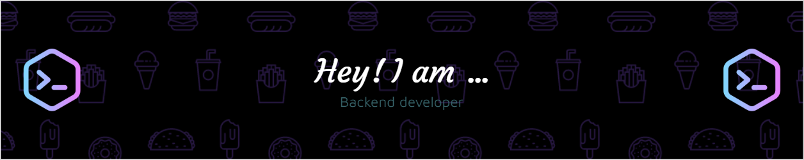

<!--
- 👋 Hi, I’m @yurseria
- 👀 I’m interested in ...
- 🌱 I’m currently learning ...
- 💞️ I’m looking to collaborate on ...
- 📫 How to reach me ...
-->

<!---
yurseria/yurseria is a ✨ special ✨ repository because its `README.md` (this file) appears on your GitHub profile.
You can click the Preview link to take a look at your changes.
--->

## 💻Tech Stack

 

 

 

 

 
![AWS](https://img.shields.io/badge/AWS-f5f5f5.svg?style=for-the-badge&logo=data:image/svg+xml;base64,PHN2ZyB4bWxucz0iaHR0cDovL3d3dy53My5vcmcvMjAwMC9zdmciIHdpZHRoPSIzMiIgaGVpZ2h0PSIzMiI+PHBhdGggZD0iTTkuMDIgMTUuMzc1YzAgLjM5NS4wMzkuNzE1LjExNy45NS4wODIuMjM0LjE5MS40ODguMzQuNzY5LjA3NC4zNTEuMDA3LjQ1Ny0uMTI1LjU2MmwtLjY3Mi40NWMtLjM4Ny4wOTctLjQ5Mi4wNDItLjU5OC0uMDUxYTMgMyAwIDAgMS0uMzgzLS41MDQgNyA3IDAgMCAxLS4zMzItLjYzcS0xLjI0MSAxLjQ3My0zLjEyOSAxLjQ3NGMtLjg5IDAtMS42MDUtLjI1OC0yLjEyNS0uNzctLjUyMy0uNTEyLS43ODktMS4xOTUtLjc4OS0yLjA1IDAtLjkwNy4zMi0xLjY0MS45NjktMi4yLjY0OC0uNTU1IDEuNTEyLS44MzIgMi42MDUtLjgzMi4zNjQgMCAuNzM1LjAzMSAxLjEzLjA4NnMuOC4xNCAxLjIyNi4yMzR2LS43NzdjMC0uODEzLS4xNzItMS4zNzktLjUtMS43MTEtLjM0NC0uMzMyLS45MTgtLjQ5Mi0xLjczOC0uNDkycS0uNTU2IDAtMS4xNDkuMTQtLjU4NS4xNC0xLjE0OC4zNjRhMyAzIDAgMCAxLS4zNzEuMTRjLS4zMi4wMzItLjM5NS0uMDc4LS4zOTUtLjN2LS41MjRjMC0uMTcyLjAyLS4zLjA3NC0uMzc1LjY2OC0uNDE4IDEuMTE4LS41NzQgMS42MzctLjcwM2E2LjQgNi40IDAgMCAxIDEuNjYtLjIwM2MxLjI3IDAgMi4xOTYuMjg5IDIuNzkuODYzLjU4NS41NzguODgyIDEuNDUzLjg4MiAyLjYzdjMuNDZaTTQuNyAxNi45OTZxLjUyLjAwMSAxLjA5My0uMTkxYTIuMzcgMi4zNyAwIDAgMCAxLjAxMi0uNjg0cS4yNTktLjMwMi4zNi0uNjgzYy4wNjUtLjI1OC4xMDgtLjU2Ny4xMDgtLjkzdi0uNDVhOC41NCA4LjU0IDAgMCAwLTEuOTgtLjI0NmMtLjcxNSAwLTEuMjM0LjE0MS0xLjU4Ni40M3MtLjUyLjY5NS0uNTIgMS4yMjdjMCAuNS4xMjYuODc1LjM5MSAxLjEzMy4yNTguMjY1LjYyOS4zOTQgMS4xMjEuMzk0bTguNTQyIDEuMTUyYy0uMTkxIDAtLjMxNi0uMDMtLjQwMi0uMTA1LS4wODYtLjA2Ni0uMTYtLjIxNS0uMjIzLS40MThsLTIuNS04LjI1NGExLjggMS44IDAgMCAxLS4wOTctLjQyNmMwLS4xNzIuMDg1LS4yNjUuMjUzLS4yNjVoMS4wNDNjLjIwNCAwIC4zNC4wMy40MTQuMTA1LjA4Ni4wNjMuMTUzLjIxMS4yMTUuNDE0bDEuNzkgNy4wNyAxLjY2LTcuMDdjLjA1LS4yMS4xMTctLjM1MS4xOTktLjQxNGwxLjI3Ny0uMTA1Yy4yMDMgMCAuMzQuMDMuNDI2LjEwNS4wODYuMDYzLjE2LjIxMS4yMDMuNDE0bDEuNjg0IDcuMTU2IDEuODQtNy4xNTYgMS42MTctLjUyYy4xNzIgMCAuMjY1LjA4Ny4yNjUuMjY2IDAgLjA1MS0uMDExLjEwNi0uMDIuMTcybC0yLjY0IDguNTJjLS4wNjIuMjE1LS4xMzcuMzUxLS4yMjMuNDE4bC0xLjMyLjEwNWMtLjIgMC0uMzQtLjAzMS0uNDI2LS4xMDUtLjA4Ni0uMDc4LS4xNi0uMjE1LS4yMDMtLjQzbC0xLjY0OC02Ljg4Ny0xLjY0IDYuODhjLS4wNTIuMjE0LS4xMTQuMzUtLjIuNDI1LS4wODYuMDc4LS4yMzQuMTEtLjQyNi4xMWgtLjkxOFptMTMuNjguMjlhNyA3IDAgMCAxLTEuNjQtLjE5MnEtLjgwNS0uMTkyLTEuMjI3LS40M2MtLjE2OC0uMDkzLS4yODUtLjE5OS0uMzI4LS4yOTZsLS4wNjMtLjg0NHEuMDAxLS4zMzMuMjQyLS4zMzJjLjI1OC4wNTQuMzU2LjA5Ny40NjEuMTQuMzYuMTYuNzU0LjI5IDEuMTY4LjM3NS40MjYuMDgyLjg0LjEyNSAxLjI2Ni4xMjVxMS4wMDkgMCAxLjU1NC0uMzUxYy4zNTYtLjIxNS41NjctLjYwMi41NTUtMS4wMTZhMS4wNCAxLjA0IDAgMCAwLS4yODktLjc0NmMtLjE4Ny0uMjAzLS41NS0uMzg3LTEuMDc0LS41NTVsLTEuNTQzLS40OGMtLjc3Ny0uMjQ2LTEuMzUyLS42MS0xLjcwMy0xLjA5YTIuNiAyLjYgMCAwIDEtLjUzMS0xLjU0N3EuMDAyLS42NzMuMjg1LTEuMTg3Yy4xOTEtLjM0LjQ0OS0uNjQuNzctLjg3NWEzLjQgMy40IDAgMCAxIDEuMTA1LS41NTUgNC42IDQuNiAwIDAgMSAxLjM0LS4xODRjLjIzOCAwIC40OC4wMTIuNzE0LjA0My4yNDMuMDMyLjQ3LjA3OS42OTIuMTIxLjIxLjA1MS40MTguMTAyLjYwNS4xNjhxLjI4Ni4wOTkuNDUuMTk2bC40MTQgMS4xMTdjMCAuMjI3LS4wODYuMzQ0LS4yNDcuMzQ0LTEuMDQ2LS40MTQtMS43NDItLjU1NS0yLjQ0NS0uNTQzLS42MDUgMC0xLjA4Ni4wOTQtMS40MTguMjk3LS4zMjguMjAzLS41LjUxMS0uNS45NTNxMCAuNDQ2LjMyLjc1OGMuMjExLjE5OS42MDYuNDAyIDEuMTcyLjU4NWwxLjUxMi40NzdjLjc2Ni4yNDYgMS4zMi41OSAxLjY0OCAxLjAyNy4zMzMuNDM4LjQ4OS45NDIuNDg5IDEuNDk2cS0uMDAxLjY5My0uMjc4IDEuMjM5YTIuOSAyLjkgMCAwIDEtLjc3My45NDFjLS4zMzIuMjY2LS43MjcuNDU3LTEuMTg0LjU5OC0uNDguMTQ4LS45OC4yMjMtMS41Mi4yMjNtMCAwIiBzdHlsZT0ic3Ryb2tlOm5vbmU7ZmlsbC1ydWxlOm5vbnplcm87ZmlsbDojMjUyZjNlO2ZpbGwtb3BhY2l0eToxIi8+PHBhdGggZD0iTTI4LjkzIDIzLjYyNWMtMy41IDIuNTk0LTguNTg2IDMuOTczLTEyLjk2MSAzLjk3My02LjEzIDAtMTEuNjU2LTIuMjc0LTE1LjgyOC02LjA1NS0uMzI4LS4zLS4wMzItLjcwMy4zNjMtLjQ2OSA0LjUxMiAyLjYyNSAxMC4wNzggNC4yMTkgMTUuODQgNC4yMTkgMy44NzkgMCA4LjE0OC0uODEzIDEyLjA3OC0yLjQ4LjU4Ni0uMjY2IDEuMDg2LjM4Ni41MDguODEybTAgMCIgc3R5bGU9InN0cm9rZTpub25lO2ZpbGwtcnVsZTpldmVub2RkO2ZpbGw6I2Y5MDtmaWxsLW9wYWNpdHk6MSIvPjxwYXRoIGQ9Ik0zMC4zODcgMjEuOTZjLS40NDYtLjU3My0yLjk1Ny0uMjc2LTQuMDk0LS4xNC0uMzQuMDQ3LS4zOTUtLjI1NC0uMDg2LS40NzYgMi0xLjQxIDUuMjktMS4wMDQgNS42NzItLjUzNS4zODMuNDgtLjEwNiAzLjc4LTEuOTggNS4zNTktLjI4Ni4yNDYtLjU2My4xMjEtLjQzOC0uMi40MjYtMS4wNjIgMS4zNzUtMy40NC45MjYtNC4wMDdtMCAwIiBzdHlsZT0ic3Ryb2tlOm5vbmU7ZmlsbC1ydWxlOmV2ZW5vZGQ7ZmlsbDojZjkwO2ZpbGwtb3BhY2l0eToxIi8+PC9zdmc+&logoColor=000000)
 

 

 

 

 

## 🔎Metrics

## 🏆GitHub Trophies

