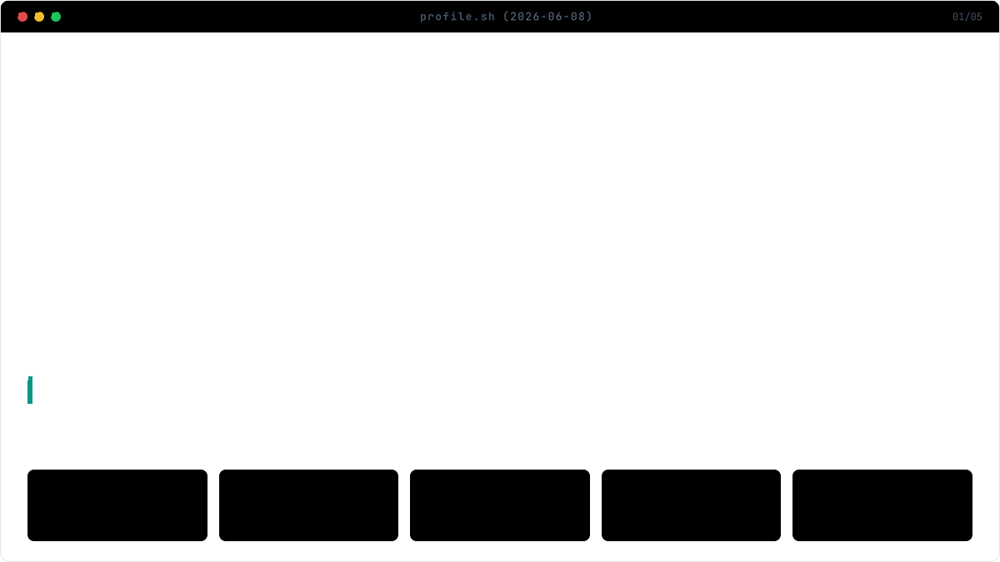
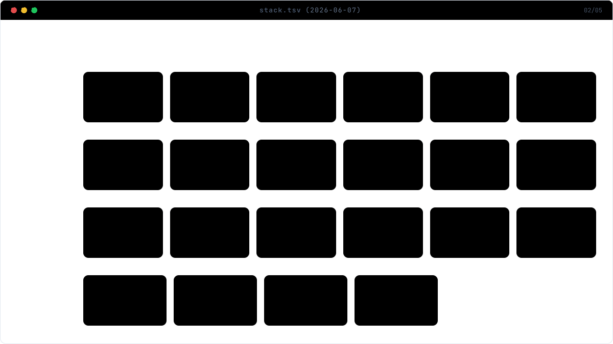
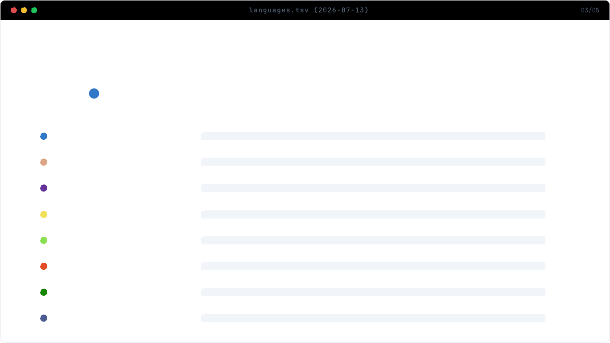
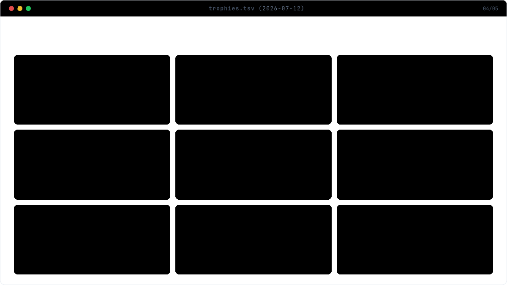
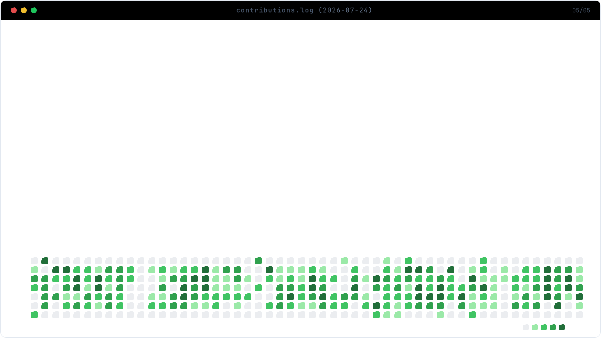

<picture>
  <source media="(prefers-color-scheme: dark)" srcset="./recap/01-hero-dark.svg">
  
</picture>

<picture>
  <source media="(prefers-color-scheme: dark)" srcset="./recap/02-stack-dark.svg">
  
</picture>

<picture>
  <source media="(prefers-color-scheme: dark)" srcset="./recap/03-langs-dark.svg">
  
</picture>

<picture>
  <source media="(prefers-color-scheme: dark)" srcset="./recap/04-trophy-dark.svg">
  
</picture>

<picture>
  <source media="(prefers-color-scheme: dark)" srcset="./recap/05-contrib-dark.svg">
  
</picture>
