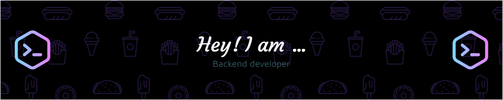

<!--
- 👋 Hi, I’m @yurseria
- 👀 I’m interested in ...
- 🌱 I’m currently learning ...
- 💞️ I’m looking to collaborate on ...
- 📫 How to reach me ...
-->

<!---
yurseria/yurseria is a ✨ special ✨ repository because its `README.md` (this file) appears on your GitHub profile.
You can click the Preview link to take a look at your changes.
--->

## 💻Tech Stack

![MikroORM](https://img.shields.io/badge/-ffffff.svg?style=for-the-badge&logo=&logoColor=white "MikroORM")

![AWS](https://img.shields.io/badge/-f5f5f5.svg?style=for-the-badge&logo=&logoColor=000000 "AWS")

  

![Braze](https://img.shields.io/badge/-ffffff.svg?style=for-the-badge&logo=&logoColor=white "Braze")
![Amplitude](https://img.shields.io/badge/-0052F2.svg?style=for-the-badge&logo=&logoColor=white "Amplitude")

## 🔎Metrics

## 🏆GitHub Trophies

